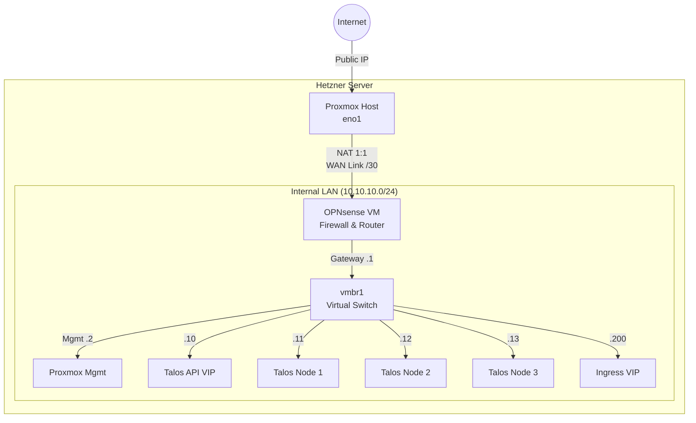

# ☸️ Kubernetes GitOps Infrastructure

This repository contains the declarative GitOps state of bare-metal Kubernetes cluster running on a dedicated server (Hetzner) virtualized via Proxmox. 

The entire infrastructure and all applications are managed via **ArgoCD** using the "App of Apps" pattern, ensuring that the cluster state always strictly mirrors this Git repository.

## 🛠️ Core Tech Stack

* **OS & Provisioning:** [Talos Linux](https://www.talos.dev/)
* **GitOps Controller:** [ArgoCD](https://argoproj.github.io/cd/)
* **Ingress & Networking:** NGINX Ingress Controller, MetalLB, Cert-Manager
* **Storage & Databases:** Longhorn (Distributed Block Storage), CloudNativePG
* **Secret Management:** Bitnami Sealed Secrets

---

## 📁 Repository Structure (App of Apps)

This repository strictly follows the **ArgoCD App of Apps** pattern. The state of the cluster is declaratively defined and split into logical components:

```text
.
├── apps/              # ArgoCD Application manifests (The root applications pointing to the charts)
├── charts/            # Local Helm charts containing the actual Kubernetes resources
│   ├── infrastructure # (e.g., ingress-nginx, cert-manager, longhorn, metallb)
│   └── workloads      # (e.g., n8n, vaultwarden, postgres-dev)
├── talos/             # Talos OS configuration and SOPS-encrypted cluster secrets
├── bootstrap.yaml     # The root ArgoCD application used to bootstrap the entire cluster
├── pub-cert.pem       # Public certificate for Kubeseal (Sealed Secrets)
└── renovate.json      # Automated dependency update configuration
```

---

## 🗺️ Network Topology

The architecture is designed to be **GitOps ready** and utilizes a strict **Double-NAT** topology for maximum isolation between public traffic and the internal network. 

Proxmox acts solely as an L1/L2 switch and a "dumb" NAT gateway. All L3 routing, firewalling, DHCP, and VPN services are handled by a virtualized **OPNsense** appliance.



### Network Interfaces (Proxmox Bridges)

| Interface | Type | IP Address / CIDR | Description & Purpose |
| :--- | :--- | :--- | :--- |
| **eno1** | Physical | *Public IP* | Physical ingress. Performs DNAT forwarding to OPNsense. |
| **vmbr0** | Bridge | `192.168.100.1/30` | **WAN Link.** Private point-to-point link between Proxmox and OPNsense. |
| **vmbr1** | Bridge | `10.10.10.2/24` | **LAN Switch.** Main internal network for the Cluster, Management, and Apps. |

---

## 📍 IP Address Plan (LAN)

* **Subnet:** `10.10.10.0/24`
* **Gateway:** `10.10.10.1` (OPNsense)
* **DNS:** `10.10.10.1` (OPNsense Unbound DNS)

| IP Address                   | Hostname        | Role            | Description                                                 |
| :--------------------------- | :-------------- | :-------------- | :---------------------------------------------------------- |
| **Infrastructure** |                 |                 |                                                             |
| `10.10.10.1`                 | **OPNsense** | **Gateway** | Main router, DHCP, Tailscale Exit Node.                     |
| `10.10.10.2`                 | **Proxmox** | Management      | Proxmox internal interface (SSH, Web GUI).                  |
| `10.10.10.3` - `.9`          | *Reserved* | -               | Reserved for core network devices.                          |
| **Kubernetes Control Plane** |                 |                 |                                                             |
| `10.10.10.10`                | **Talos VIP** | **Cluster VIP** | **Virtual IP for API Server.** Target for `talosctl`/ArgoCD.|
| `10.10.10.11`                | `talos-node-1`  | CP              | Control Plane Node 1.                                       |
| `10.10.10.12`                | `talos-node-2`  | CP              | Control Plane Node 2.                                       |
| `10.10.10.13`                | `talos-node-3`  | CP              | Control Plane Node 3.                                       |
| **Applications (MetalLB)** |                 |                 |                                                             |
| `10.10.10.200`               | **Ingress VIP** | **Ingress** | Main ingress for HTTP/HTTPS (Websites, Webhooks).           |
| `10.10.10.201`               | *DB Access* | VIP             | Direct TCP access to the HA database.            |
| `10.10.10.202` - `.250`      | *Pool* | LoadBalancer    | Dynamic pool for standard LoadBalancer services.            |
| `10.10.10.100` - `.199`      | *DHCP* | Clients         | DHCP range for temporary VMs and VPN clients.               |

---

## 🛡️ Remote Access (VPN / Tailscale)

All management access (SSH, Proxmox GUI, Talos API) is strictly hidden behind the firewall and is **not exposed** to the public internet. Secure access is provided via **Tailscale**.

* **Location:** The `os-tailscale` plugin running directly on the OPNsense router.
* **Configuration:**
    * **Subnet Router:** Enabled (`--advertise-routes=10.10.10.0/24`).
    * **Exit Node:** Optionally enabled (for secure browsing tunneling through the server).
* **Access Points (via VPN):**
    * **Proxmox GUI:** `https://10.10.10.2:8006`
    * **Talos API:** `https://10.10.10.10:6443`
    * **OPNsense GUI:** `https://10.10.10.1`

---

## ⚙️ Host Configuration (Proxmox)

The `/etc/network/interfaces` file handles routing between the physical network and the OPNsense VM.

**Key Security Concepts:**
* The `vmbr0` network is strictly a `/30` (allowing only 2 hosts), minimizing the attack surface.
* Proxmox holds the `.2` IP on `vmbr1` but **does not** have a gateway configured there (it uses `eno1` as its default route).

```bash
source /etc/network/interfaces.d/*

auto lo
iface lo inet loopback

iface lo inet6 loopback

# --- 1. PUBLIC INTERFACE (Internet) ---
auto eno1
iface eno1 inet static
    address <PUBLIC_IP>/26
    gateway <PUBLIC_GATEWAY>
    
    # Static route for Hetzner networking
    up route add -net <PUBLIC_SUBNET> netmask 255.255.255.192 gw <PUBLIC_GATEWAY> dev eno1

# --- IPv6 CONFIGURATION (DISABLED) ---
# iface eno1 inet6 static
#	address <PUBLIC_IPV6>/64
#	gateway fe80::1

# --- 2. WAN LINK (Proxmox <-> OPNsense connection) ---
# Network: 192.168.100.0/30
# .1 = Proxmox Host
# .2 = OPNsense WAN
auto vmbr0
iface vmbr0 inet static
    address 192.168.100.1/30
    bridge-ports none
    bridge-stp off
    bridge-fd 0
    
    # Enable IP forwarding in the kernel
    post-up   echo 1 > /proc/sys/net/ipv4/ip_forward

    # 1. OUTBOUND NAT (Masquerade)
    post-up   iptables -t nat -A POSTROUTING -s '192.168.100.0/30' -o eno1 -j MASQUERADE
    post-down iptables -t nat -D POSTROUTING -s '192.168.100.0/30' -o eno1 -j MASQUERADE

    # 2. INBOUND PORT FORWARDING (Internet traffic -> OPNsense)
    # HTTP (80)
    post-up   iptables -t nat -A PREROUTING -i eno1 -p tcp --dport 80 -j DNAT --to 192.168.100.2:80
    post-down iptables -t nat -D PREROUTING -i eno1 -p tcp --dport 80 -j DNAT --to 192.168.100.2:80
    
    # HTTPS (443)
    post-up   iptables -t nat -A PREROUTING -i eno1 -p tcp --dport 443 -j DNAT --to 192.168.100.2:443
    post-down iptables -t nat -D PREROUTING -i eno1 -p tcp --dport 443 -j DNAT --to 192.168.100.2:443

    # Minecraft Bedrock (UDP 19132)
    post-up   iptables -t nat -A PREROUTING -i eno1 -p udp --dport 19132 -j DNAT --to 192.168.100.2:19132
    post-down iptables -t nat -D PREROUTING -i eno1 -p udp --dport 19132 -j DNAT --to 192.168.100.2:19132

# --- 3. LAN SWITCH (Internal Network) ---
auto vmbr1
iface vmbr1 inet static
    address 10.10.10.2/24
    bridge-ports none
    bridge-stp off
    bridge-fd 0
    comment "LAN Network"
    # Gateway is intentionally omitted here. Proxmox uses eno1 as the default gateway.
```

## 🚦 Packet Flow

### 1. Outbound Traffic
*Example: A Talos Node pulling a Docker Image from Docker Hub.*

1. **Talos Node** (`.11`) sends a request to its default gateway → **OPNsense** (`.1`).
2. **OPNsense** performs NAT and routes the request to its gateway → **Proxmox** (`.100.1`).
3. **Proxmox** performs a second NAT (Masquerade) and sends the request out to the **Internet**.

### 2. Inbound Traffic (Webhooks)
*Example: An external service calling `https://webhook.mracek.dev`.*

1. The **Internet** hits the server's Public IP on port 443.
2. **Proxmox** (`eno1`) intercepts the packet and `iptables` forwards it via DNAT to the **OPNsense WAN** (`192.168.100.2`).
3. **OPNsense** receives the packet and applies a Port Forward rule, routing it to the internal **Ingress VIP** (`10.10.10.200`).
4. **MetalLB** inside the cluster (via ARP) receives the packet on the node currently running the Ingress Controller speaker.
5. **NGINX Ingress** terminates the TLS connection and forwards the request to the `n8n` service pod.
